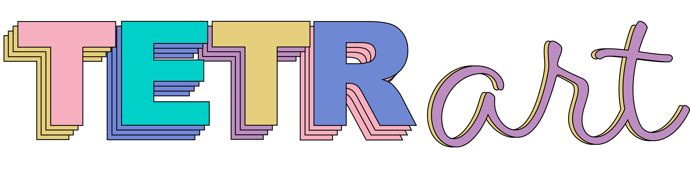

# Tetr'Art



Tetr'Art est un jeu type puzzle basé sur des œuvres d’Art célèbres. Chaque niveau représente une œuvre spécifique issue d’un mouvement artistique. L’objectif du joueur est de reconstituer l’image en plaçant correctement des pièces en forme de tétrominos sur une grille.

## Installation et Exécution

### Prérequis
Avant d’installer et d’exécuter le jeu, assurez-vous d’avoir :

- **Python 3.13.0** installé sur votre machine. 
- **pip** (le gestionnaire de paquets Python).
- **Les bibliothèques nécessaires**, listées dans `requirements.txt`.

### Installation

1. **Cloner le dépôt du projet** (ou télécharger les fichiers) :

    ```sh
    git clone https://github.com/andreacaratti/tetr-art.git
    cd nom-du-projet
    ```

2. **Créer un environnement virtuel** (optionnel mais recommandé) :

   Sur macOS/Linux :
   ```sh
   python -m venv venv
   source venv/bin/activate
   ```

   Sur Windows :
   ```sh
   python -m venv venv
   venv\Scripts\activate
   ```

3. **Installer les dépendances** :

   ```sh
   pip install -r requirements.txt
   ```

### Exécution du jeu

Une fois l’installation terminée, vous pouvez lancer le jeu avec :
```sh
python sources/main.py
```

## Gameplay

### Mécaniques principales

- Le joueur sélectionne et place les pièces manuellement sur la grille.
- Les pièces peuvent être déplacées avec la souris ou le clavier.
- Il est possible de faire pivoter une pièce avec la touche R ou un double-clic.
- La grille s’adapte à la difficulté choisie :
    - **Facile** &#8594; 10x10
    - **Moyen** &#8594; 16x16
    - **Difficile** &#8594; 20x20

### Chronomètre et Score

Chaque niveau est limité dans le temps. Le joueur doit compléter le puzzle avant la fin du minuteur.
Le score est calculé en fonction du nombre de pièces correctement placées :

$ \text{Score (\%)} = \frac{\text{Nombres de pièces bien placées}}{\text{Nombre total de pièces}} \times 100 $

Une fois le temps écoulé ou le puzzle terminé, le pourcentage de réussite s’affiche accompagné d'un message.

### Commandes

Les touches peuvent être configurées par le joueur dans le menu options. Les touches par défaut sont :
- **Déplacement vers la gauche** : `A` ou flèche de gauche
- **Déplacement vers la droite** : `D` ou flèche de droite
- **Placer la pièce** : `S` ou flèche du bas
- **Rotation de la pièce** : `R` ou double clic (moins de 500ms entre les clics)

Le jeu est optimisé pour tourner à une fréquence fixe de 60 images par seconde, pour une expérience fluide.

## Licence

- Le code source du projet est sous **GPLv3** ([voir licence.txt](licence.txt)).
- Les polices utilisées sont sous **OFL (Open Font License)** ([voir la licence](https://openfontlicense.org/open-font-license-official-text/)).
- Les assets (images, sons, etc.) sont sous **CC-BY-SA 4.0**.

Veuillez consulter le fichier de licence pour plus de détails.

## Crédits

### Développeurs

- Andrea CARATTI - Chef de projet et de la programmation, 
- Issam MOUTAWAKKIL - Gestion de l'audio et implémentation, 
- Mohamad KARANOUH - Polyvalent, programmation du jeu, 
- Raphael BRICAUD - Interface et design UI et implémentation,, 
- Ulysse LEONARD SCHWARZ - Gestion des niveaux et implémentation,.

### Ressources utilisées

#### Polices :

- Chakra Petch – SIL Open Font License
- Bai Jamjuree – SIL Open Font License
- Press Start 2P – SIL Open Font License

#### Assets (images, sons, etc.) :

Sous licence CC-BY-SA 4.0

Pour plus de détails, consultez ([licence.txt](licence.txt))
