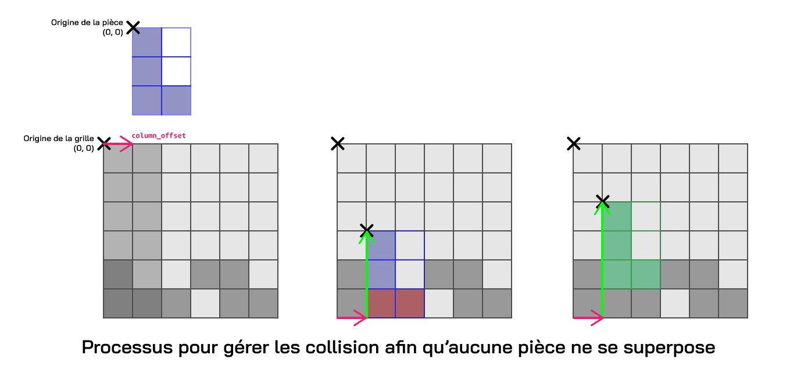

# Fonctionnement du jeu

## Scènes du Jeu

### 1. Menu principal (`Menu`)

### 2. Menu de sélection (`Selection`)

### 3. Menu des paramètres (`Settings`)

Le menu des paramètres permet à l'utilisateur de modifier les réglages du jeu comme le volume, l'affichage et les commandes.
Ce menu permet de modifier les attributs de l'instance de `UserConfig` _\(comme mentionné [précédemment](engine.md#userconfig)\)_

# Principes théoriques et implémentation du gameplay

## 1. Gestion de la grille et placement des pièces

Le jeu utilise une grille en deux dimensions. Les pièces, représentées par une classe contenant une matrice, doivent être placées dans cette grille selon des règles de validité (collision, limites). Ce concept repose sur une abstraction typique des jeux de puzzle où l’espace est discret et les interactions se font à l’aide de coordonnées entières.

La classe `Grid` (importée depuis `game.grid`) permet de créer la grille de dimensions variables (width x height), initialisée dans Jeu.load avec des valeurs par défaut (6x7) ou selon le niveau chargé (self.level.size).

La pièce actuellement en train d'être placée (qu'on appelera la pièce actuelle) est référencée dans la variable `self.placing`.

La méthode `try_place()` appelle `grid.place_piece(self.placing)` pour vérifier si une pièce peut être placée à une position donnée (`column_offset`, calculé à partir des interactions utilisateur). Si la position est valide, la pièce est ajoutée à `self.placed_pieces` avec une animation de chute (`falling_animation_offset`).
Les collisions sont gérées en comparant la matrice de la pièce (`self.placing.matrix`) avec la matrice actuelle de la grille, garantissant qu’aucune superposition arrive ou sortie des limites de la grille.

## 2. Interaction utilisateur : Glisser-déposer et contrôles

Le joueur interagit avec les pièces soit avec un glisser-déposer (drag and drop), soit avec les touches du clavier, comme mentionné précedemment.

### Glisser-déposer 

Le glisser-déposer est implémenté dans trois méthodes dans `Jeu` :`drag_start`, `drag`, et `drag_stop`. 

- `drag_start()` : Cette méthode est appelée lors d’un clic sur la pièce actuelle (vérifié avec `touching`). Elle initialise le déplacement en enregistrant la position initiale du clic dans `self.placing.drag_start` et active le mode glisser (`self.placing.drag = True`).

- `drag()` : Appelée lors du déplacement de la souris, elle met à jour `self.placing.drag_screen_offset` en calculant la différence entre la position actuelle de la souris et la postion enregistrée dans `self.placing.drag_start`, pour permettre un suivi visuel en temps réel.

- `drag_stop()` : Cette méthode est appelée au relâchement du clic, elle finalise l’action. Pour éviter les placements accidentels, elle vérifie si la durée du clic dépasse 200 ms (avec `pygame.time.get_ticks() - self.last_click`). Si oui :
    - Le déplacement latéral est converti en colonnes (`drag_offset`) et appliqué avec `move_piece`.
    - Si la pièce est suffisamment "descendue" (dépassant `PLACING_VALID` sur l’axe Y), `try_place()` est appelée. En cas de succès, la pièce est placée, et `next_piece()` sélectionne la suivante.

Lorsqu’un clic est détecté avec la méthode `handle_event` sur la pièce actuellement en train d'être placée (avec la méthode `touching`), le déplacement est calculé et affecté à la variable `drag_screen_offset`. La pièce est placée si elle est suffisamment "descendue" (la limite en pixel est définie par la constante `PLACING_VALID` dans `contants.py`).

### Touches du clavier

Dans handle_event si une touche du calvier est détectée, on compare les touches configurées dans `self.settings.inputs` pour permettre de le déplacer latéralement (avec `move_piece`), pivoter (avec `rotate`), ou placer une pièce (avec `try_place`).
Un double clic, détecté dans la méthode `on_click` si deux clics sont détectés en moins de 500ms, permet la rotation de la pièce actuelle.