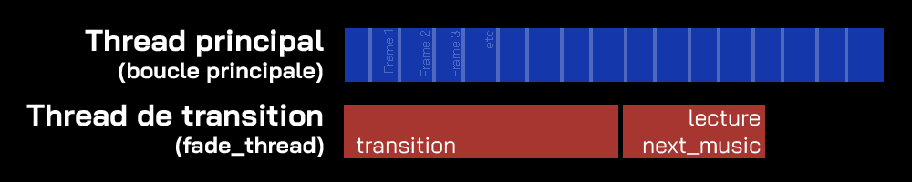

# Structure du jeu

## Moteur de jeu simplifié

Le moteur de jeu est défini dans `engine/game_engine.py`. Il est responsable de :
- La gestion de la boucle principale _(avec la méthode `run()`)_. Elle permet :
    - Le rafraîchissement de l’écran et la gestion du temps _(`dt`)_
    - La gestion des événements utilisateurs
- Le changement de scène _(avec la méthode `change_scene()`)_

### 1. Boucle principale

Le jeu repose sur une boucle tournant à 60 images par seconde

```python
while not self.quit:
    dt = self.clock.tick(60)/1000  # Limite à 60 IPS (FPS)

    # Gestion des événements
    for event in pygame.event.get():
        if self.current_scene and self.current_scene._loaded:
            self.current_scene.handle_event(event)
        if event.type == pygame.QUIT:
            self.quit = True

    if self.current_scene and self.current_scene._loaded:
        self.current_scene.update(dt)
        self.current_scene.draw(self.screen)

    # Rafraîchissement de l'écran
    pygame.display.flip()

# Quand la boucle principale est terminée
pygame.quit()
sys.exit()
```
Ce qui est fait dans la boucle :
- On limite les images par secondes (IPS ou FPS) à 60
- On délègue la gestion des entrées à la scène
- On met à jour et on affiche la scène
- On rafraîchit l’écran avec `pygame.display.flip()`

### 2. Changement des scènes

Chaque scène est stockée dans un dictionnaire. Les scènes sont ajoutée depuis `main.py` :
```python
game.scenes = {
    "Menu": Menu(game),
    "Selection": Selection_Menu(game),
    "Settings": Settings_Menu(game),
    "Loading": Loading_Screen(game),
    "Jeu": Jeu(game)
}
```

La méthode `change_scene()` permet de charger une scène en fonction de son nom associé dans le dictionnaire. Elle prend comme arguments :
- `scene_name` : Le nom de la scène.
- `reload_scene` : Si on veut recharger la scène. Chaque scène est une instance, elle conserve donc tous ses attributs, même lorsqu'on change la scène active.
- `scene_arguments`: Les arguments associés. _(explication détaillée ultérieurement)_

## Fonctionnement des scènes.

Chaque scène possède 4 méthodes :
```python
def load(game, scene_arguments)
def update(dt)
def draw(screen)
def handle_event(event)
```
- `load(game, scene_arguments)` est utilisé à la place de `__init__` pour éviter un chargement immédiat dès qu'une instance de la scène est créée. Arguments :
    - `game` est une référence à l'instance du jeu.
    - `scene_arguments` est un dictionnaire.
- `update(dt)` est appelée à chaque frame pour mettre à jour la logique du jeu. Argument :
    - `dt` correspond à l'intervalle en seconde entre la dernière image et l’image actuelle
- `draw(screen)` permet d'afficher la scène sur l’écran. Argument :
    - `screen` correspond à une surface pygame.
- `handle_event(event)` gère les évènements utilisateurs. Argument :
    - `event` est évènement pygame _(`pygame.event.Event`)_

## Système d'interface

Le système d'Interface Utilisateur (UI) est conçu pour faciliter la création d'éléments d'interface dans les scènes du jeu. 
Le système est divisé en deux partie : le gestionnaire et les éléments.

### 1. Gestionnaire d’interface (`UIManager`) 

Chaque scène contient une instance de `UIManager` (affectée à ‘self.ui_manager’). Il centralise la gestion des éléments d’interface. 
Les gestionnaire possède les méthodes suivantes: 

- `add_element(element)` : pour ajouter tout objet dérivé de `UIElement` au gestionnaire. Si un objet n’appartient pas à ce type, il est ignoré.
- `remove_element(element)` : permet de retirer un élément. 
- `draw(screen)` : appelle la fonction `draw` de chaque élément visible.
    - `screen` correspond à une surface pygame.
- `handle_event(event)` transmet les évènements utilisateurs aux éléments de l'interface.
    - `event` est un évènement pygame _(`pygame.event.Event`)_

### 2. Éléments d’interface (‘UIElement’) 

Tous les éléments d’interface sont des sous-classes de la classe `UIElement`. Chaque `UIElement` possède les attributs suivants :
- Position et taille : définies par `self.rect` (un `pygame.rect.Rect`).
- `self.visible` permet de masquer l’élément si égale à `False`.
- `self.interactive` permet de désactiver les interactions utilisateur.

Les éléments d’interface possèdent les méthodes suivantes : 
- `draw(screen)` permet d'afficher l'élément sur l’écran.
    - `screen` correspond à une surface pygame.
- `handle_event(event)` gère les évènements utilisateurs.
    - `event` est évènement pygame _(`pygame.event.Event`)_

Ces deux méthodes s'utilisent de la même manière que pour les scènes.

## Module Settings

Le module `settings.py` gère la configuration de l’utilisateur, y compris le choix des touches et d’autres paramètres comme le volume et la taille de l'interface.

### KeyInput

La classe `KeyInput` représente une commande à laquelle on associe des touches du clavier.

#### Attributs :

- `name` (str) : Nom d’identifiant de l’action.
- `display` (str) : Le nom d’affichage de le menu des options.
- `keys` (list): Une liste de touches associées à la commande.

#### Méthodes:

- `isPressed(event)`: Renvoie `True` si la touche associée à l’événement pygame `event` correspond à une touche associée.

### UserConfig

C'est une classe qui enregistre les paramètres que l'utilisateur peut modifier.

#### Attributs :

- `SIZE_FACTOR` (float): Correspond au facteur d'échelle pour l'affichage du jeu et l'interface.
- `inputs` (dict): Dictionnaire qui associe les noms d'une action/commande à une instance de `KeyInput`

## SoundManager Module

Le module `sound_manager.py` s'occupe des effets sonores et de la musique de fond.
Ce module ne possède qu'une seule classe : `SoundManager`.
Ses attributs publics sont :
- `volume_sfx` (float): Volume pour les effets sonores.
- `volume_musi`c (float): Volume pour la musique de fond.
- `sfx` (dict): Dictionnaire qui associe des noms (str) à des `pygame.mixer.sound`.
- `musics` (dict): Dictionnaire qui associe des noms à des chemins qui correspondent aux musiques.

Ses attributs privés (à ne pas modifier directement) sont :
- `audio_available` (bool): Indique si le mixer de pygame a été initialisé.
- `next_name` (str): Nom de la prochaine musique qui sera jouée après une transition.
- `actual` (str): Nom de la musique actuellement jouée.
- `loop` (bool): Indique si la prochaine musique sera jouée en boucle.
- `fade_thread` (Thread): Un deuxième thread qui gère la transition entre la musique actuelle et la prochaine définie dans `next_name`.

Méthodes:
- `play_sound(name, loop)` Joue un effet sonore à partir de son nom. si `loop==True` le son sera joué en boucle.
- `next_music()` Joue la prochaine musique. Le nom doit être renseignée dans `self.next_name`.
- `stop_music()` Arrête la musique avec un fondu.
- `__change_music()` Méthode privée utilisée dans le deuxième thread.
- `change_music(name, loop)` Change la musique de fond avec une transition. L'argument `name` correspond au nom de la prochaine musique

La fonction `change_music` démarre le fondu avec `pygame.mixer.music.fadeout()`. Pour attendre la fin du fondu sans mettre la boucle principale en pause nous avous dû utiliser du parallélisme _(voir schéma ci-dessous)_. Cette fonction appelle donc la fonction `__change_music` dans un deuxième thread.

