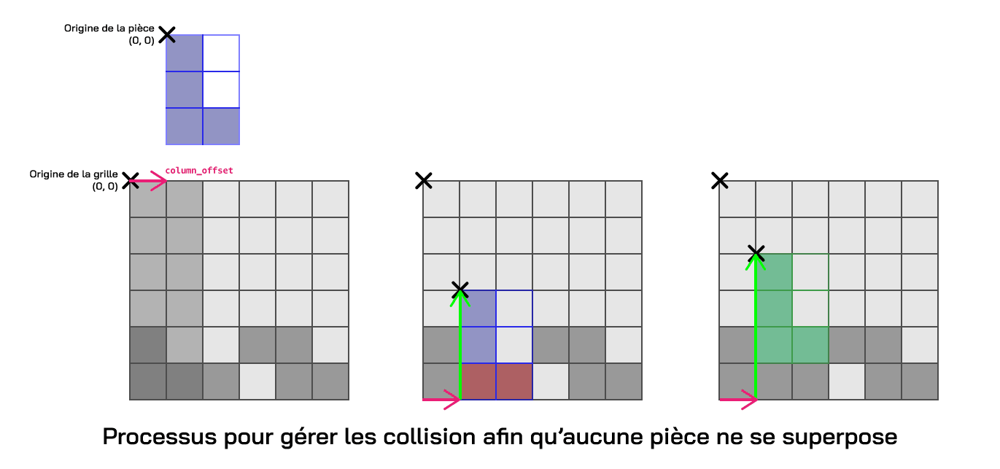

# Principes théoriques et implémentation du gameplay

Ce document détaille l’implémentation du gameplay de la scène principale du jeu, représentée par la classe `Jeu` (définie dans `jeu.py`). Héritant de la classe `Scene` du moteur, `Jeu` gère l’interaction utilisateur, la logique de placement des pièces, et l’affichage dynamique d’une grille de puzzle. Elle est instanciée dynamiquement lors du lancement d’une partie et initialisée via la méthode `load`, qui configure le niveau, la grille, et les éléments d’interface. Les autres scènes (Menu, Paramètres, etc.) sont documentées séparément dans `scenes.md`, tandis que le chargement des niveaux et des ressources est traité dans un fichier dédié.

## 1. Gestion de la grille et placement des pièces

Le jeu utilise une grille en deux dimensions. Les pièces, représentées par une classe contenant une matrice, doivent être placées dans cette grille selon des règles de validité (collision, limites). Ce concept repose sur une abstraction typique des jeux de puzzle où l’espace est discret et les interactions se font à l’aide de coordonnées entières.

La classe `Grid` (importée depuis `game.grid`) permet de créer la grille de dimensions variables (`width` x `height`), initialisée dans `Jeu.load()` avec des valeurs par défaut (6x7) si aucun niveau n'a pu être chargé, ou selon les dimensions dans `self.level.size` si un niveau est fourni.

La pièce actuellement manipulée par le joueur, appelée "pièce actuelle", est stockée dans `self.placing`. 
Cette pièce prise soit d’une liste prédéfinie (`self.level.pieces` dans le cas d’un niveau), soit générée aléatoirement (avec la méthode `Piece()` par défaut).

La méthode `try_place()` appelle la méthode `grid.place_piece(self.placing)`. Cette dernière vérifie si la pièce peut être insérée à la colonne indiquée par `self.placing.column_offset` (déterminée par les interactions du joueur). 
Elle parcourt la grille de bas en haut pour trouver la première position valide, en s’assurant que :

- La pièce ne dépasse pas les limites de la grille (`grid_x < self.width`).
- Aucune cellule occupée de la pièce ne se superpose avec une cellule déjà remplie dans `self.matrix` (dans `Grid`).

Si la position est valide, la pièce est ajoutée à `self.placed_pieces` avec une animation de chute (`falling_animation_offset`). Cette variable est initialisée à la hauteur de la chute en pixels et diminue progressivement dans `Jeu.update()` (avec `FALLING_SPEED * dt`) pour simuler une descente fluide jusqu’à sa position finale. Il ne s'agit que d'un décalage visuel, la position réelle de la pièce dans la grille ne change pas.

### Affichage de la grille

La grille est dessinée dans `grid.draw` avec des lignes gris clair pour délimiter les cellules, facilitant la visualisation pour le joueur. Une "ombre" transparente est également affichée sous la pièce actuelle pour indiquer où elle tombera si elle est placée, calculée à partir de `column_offset` et ajustée par le déplacement en cours (`drag_screen_offset`).

### Gestion des pièces placées

Les pièces placées sont stockées dans `self.placed_pieces`. Elles peuvent être retirées en cliquant dessus (avec `on_click()`), ce qui les supprime de la grille (`grid.remove_piece`) et les remet comme nouvelle `self.placing`, permettant une mécanique de correction au gameplay.

## 2. Interaction utilisateur : Glisser-déposer et contrôles

Le joueur interagit avec les pièces soit avec un glisser-déposer (drag and drop), soit avec les touches du clavier, comme mentionné précedemment.

### Glisser-déposer 

Le glisser-déposer est implémenté dans trois méthodes dans `Jeu` :`drag_start`, `drag`, et `drag_stop`. 

- `drag_start()` : Cette méthode est appelée lors d’un clic sur la pièce actuelle (vérifié avec `touching`). Elle initialise le déplacement en enregistrant la position initiale du clic dans `self.placing.drag_start` et active le mode glisser (`self.placing.drag = True`).

- `drag()` : Appelée lors du déplacement de la souris, elle met à jour `self.placing.drag_screen_offset` en calculant la différence entre la position actuelle de la souris et la postion enregistrée dans `self.placing.drag_start`, pour permettre un suivi visuel en temps réel.

- `drag_stop()` : Cette méthode est appelée au relâchement du clic, elle finalise l’action. Pour éviter les placements accidentels, elle vérifie si la durée du clic dépasse 200 ms (avec `pygame.time.get_ticks() - self.last_click`). Si oui :
    - Le déplacement latéral est converti en colonnes (`drag_offset`) et appliqué avec `move_piece`.
    - Si la pièce est suffisamment "descendue" (dépassant `PLACING_VALID` sur l’axe Y), `try_place()` est appelée. En cas de succès, la pièce est placée, et `next_piece()` sélectionne la suivante.

La constante `PLACING_VALID` est définie dans `constants.py`. Si la pièce actuelle est tirée au-delà, elle est considérée comme "lâchée" dans la grille. Sinon, elle revient à sa position initiale au-dessus de la grille.

### Touches du clavier

Les contrôles avec le clavier sont gérés dans `handle_event` en fonction des touches configurées dans `self.settings.inputs`. Les actions disponibles incluent :
- **Déplacement latéral** : Les touches associées à "left" et "right" appellent `move_piece(-1)` ou `move_piece(1)` pour ajuster `column_offset`, avec des limites empêchant la pièce de sortir de la grille.
- **Rotation** : La touche associée à "rotate" appelle `self.placing.rotate()`, qui pivote la matrice de la pièce de 90° dans le sens horaire et ajuste sa position pour rester alignée en bas à gauche.
- **Placement rapide** : La touche associée à "down" appelle `try_place()` directement, plaçant la pièce si possible et passant à la suivante avec `next_piece()`.

Un double-clic est détecté dans `on_click()` si deux clics surviennent en moins de `500ms`. Il permet aussi une rotation de la pièce actuelle, rendant cette mécanique aussi accessible avec la souris. Pour éviter des rotations involontaires, `last_click` est réinitialisé après chaque double-clic.

### Stock de pièces

Un menu latéral ("stock") affiche les pièces restantes (`self.level.pieces`), dessiné dans `Jeu.draw()`. Cliquer sur une pièce du stock (avec `on_click()` et stock_rects) appelle la méthode `swap_piece()`, qui échange la pièce actuelle avec celle sélectionnée, conservant la position latérale (`column_offset`) pour une expérience fluide.

## 3. Gestion des niveaux et fin de partie

Chaque niveau (classe `level`) définit la taille de la grille de jeu avec `size`, la liste de pièces à placer `pieces` (cette liste est générée aléatoirement, explication détaillée ultérieurement), une durée (`duration`), et une image à reconstituer. Dans `Jeu.load()`, le niveau chargé précédemment est récupéré dans `scene_arguments["loaded_lvl"]`.
Le jeu peut se terminer soit par l’expiration du chronomètre (`self.timer.ended`), soit lorsque toutes les pièces sont placées. La méthode `end_check` calcule un score (en %) avec la méthode `level.check`. Une pièce est considérée comme bien placée si les position et rotation des pièces correspondent à leurs valeurs correctes (`correct_pos`, `rotation == 0`).
Si le score atteint 100% avant la fin du chronomètre, un popup s’affiche montrant un message de réussite (image), accompagné du pourcentage obtenu. Sinon le pop-up affiche un message de défaite.

