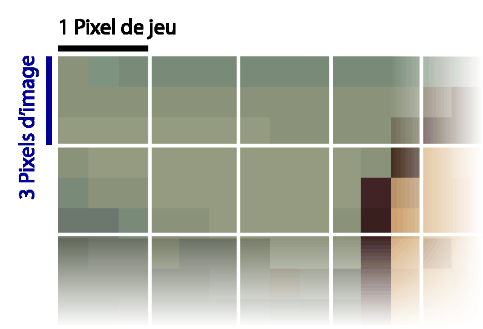
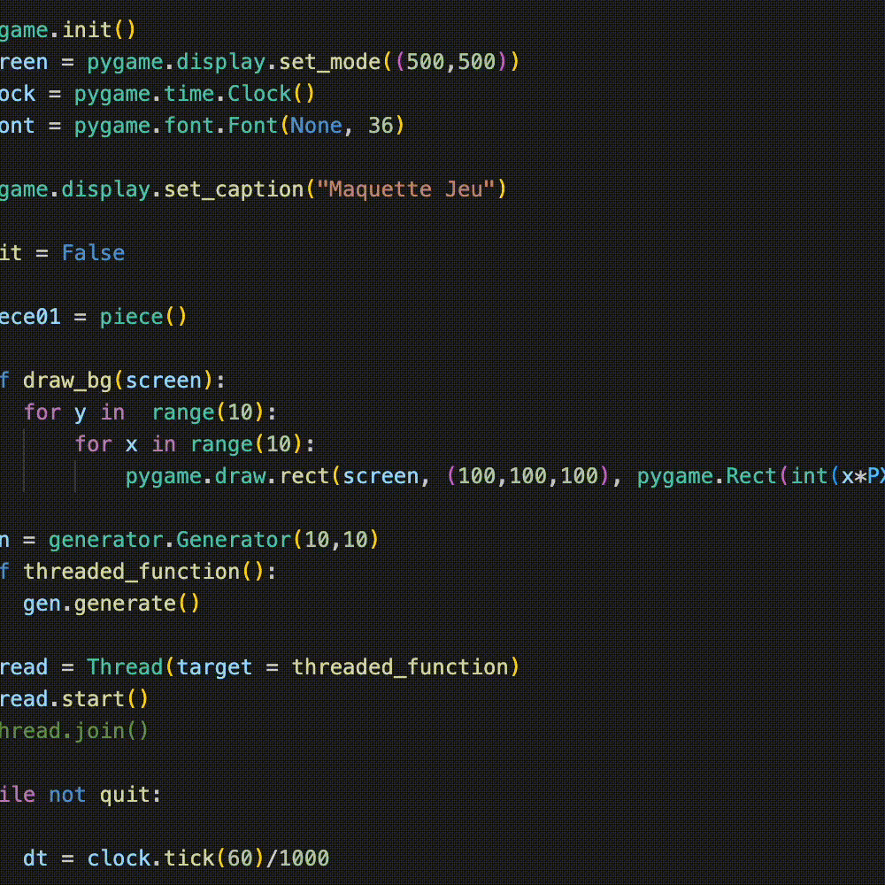

# Chargement des niveaux et génération des ressources

Ce document décrit le processus de chargement des niveaux et de génération des ressources utilisé dans le jeu. Ce mécanisme à lieu dans la scène `Loading_Screen` (classe définie dans `loading.py`), qui hérite de `Scene` et agit comme une étape intermédiaire entre le menu et la scène de jeu (`Jeu`). Elle prépare les éléments nécessaires, comme la grille, les pièces, et les textures, avant de passer à la partie jouable.

## 1. Fonctionnement du chargement

La scène `Loading_Screen` est chargée lorsqu’un niveau est sélectionné depuis le menu. Elle est initialisée avec la méthode `load`, qui prend un argument `scene_arguments` contenant le numéro du niveau (`lvl`). Le chargement se déroule en trois étapes principales :
- **Sélection du niveau** : Un objet de niveau prédéfini _(ex : `Lvl0MonaLisa`)_ est choisi selon `level_number`.
- **Chargement de l’image** : L’image associée au niveau est découpée en plusieurs surfaces pour les pièces (avec `load_image` et `split_image`).
- **Génération des pièces** : Une grille est remplie de pièces (avec un généraeur `Generator`), qui sont ensuite utilisées pour le gameplay.

Un thread séparé (`loading_thread`) exécute la méthode `load_level` pour éviter de bloquer l’affichage, qui montre un texte "Loading..." sur un fond gris foncé (`bg_color = (30,30,30)`). Une fois le chargement terminé (`level_loaded = True`) et après un délai d'au moins une seconde, le jeu passe à la scène `Jeu`.

## 2. Chargement et découpage de l’image (`split_image`)

Chaque niveau (dérivé de `level` dans `level.py`) inclut une image à reconstituer, stockée dans `level.image`. La méthode `load_image` appelle `split_image` pour diviser cette image en une matrice de surfaces utilisables comme textures pour les pièces.
- Une image Pygame est chargée avec `pygame.image.load` dans les classes des niveaux (comme par exemple `Lvl0MonaLisa`).
- L’image est découpée en carrés de taille `PIXELS_PER_TILE` (par défaut 3 pixels) sur sa largeur et hauteur.
- Chaque carré est extrait dans `sub_surface` avec `blit`, puis redimensionné à `(PIXEL_D_SIZE - PIXEL_BORDER) * SIZE_FACTOR`.
- Le résultat est enregistré dans `level.image`, une matrice en 2D qui correspond à la grille de jeu.

La résolution `PIXELS_PER_TILE` permet d'avoir un compromis entre pixel art et jouabilité.

Après le découpage, dans `load_level` la matrice de chaque pièce du niveau est convertie avec la méthode `convert_matrix`. Les valeurs de la matrice (initialement des `1` ou `None`) sont remplacées par des coordonnées `Vector2` correspondant à leur position dans `level.image`. Ainsi, lors de l’affichage dans `Jeu.draw`, chaque cellule d’une pièce est texturée avec la sous-surface appropriée, pivotée selon `rotation`.

## 3. Génération des pièces (classe `Generator`)

La classe `Generator` (dans `generator.py`) est utilisée pour remplir la grille avec des pièces de tétrominos. la liste de pièces possibles se trouve dans `pieces_list.py`. Pour garantir que la grille soit entièrement remplissable, il faut que son aire (en pixel de jeu) soit divisible par 4 sans avoir de reste car chaque pièce occupe 4 cellules. 

Par exemple, pour le premier niveau, l'aire de la grille est $10 \times 10 = 100$ et $100 \mod 4 = 0$

### Fonctionnement du générateur

**Initialisation :**
- Dimensions : `width` et `height` du niveau.
- Objectif : Remplir la grille avec `max_pieces = height * width // 4` pièces.
- Aléatoire initial : `randomness` correspond au nombre de pièces qui sont placées à des positions aléatoires (`initial_randomness`) dès le début de la génération. Cela permet des résultats moins prévisibles. Cependant nous avons évité car cela peu mener à des combinaisons de grilles impossibles à compléter.

**Algorithme :**
- Il parcourt la grille de bas en haut, de gauche à droite (`placing_position`).
- Pour chaque position, `place_random` choisit une forme dans `pieces_list` ("I", "O", "T", "L", "J", "Z" ou "S") et tente de la placer avec une rotation aléatoire (`place_piece`).
- Puis il vérifie la validité via `check_placement`, qui analyse les zones vides restantes pour s’assurer qu’elles sont aussi divisibles par 4 (taille d’un tétrimino).

(Sur l'animation ci-dessus, les numéros correspondent aux "noms" des zones vides. Cela permet de récupérer chaque différente zone vide).

**Essais :**
- Si la grille n’est pas remplie après un essai, elle est réinitialisée jusqu’à atteindre la limite d'essais `ATTEMPS_MAX = 25`.
- L’aléatoire (`randomness`) est réduit après `ATTEMPS_RISK = 18` ou `ATTEMPS_MODERATE = 10` pour éviter trop de configurations chaotiques à la suite.

### Récupération de la génération
Dans `load_level` :
- Les pièces générées sont copiées dans `self.level.pieces`.
- Chaque pièce reçoit une rotation aléatoire (0 à 3 fois) avec `rotate` pour varier leur orientation, et ajouter une difficulté supplémentaire au jeu.

## 4. Utilisation dans la scène `Jeu`
Une fois le niveau chargé :
- `self.level` est transmis à `Jeu` via `scene_arguments["loaded_lvl"]`.
- La grille est initialisée avec `self.level.size`, et les pièces de `self.level.pieces` sont utilisées dans l’ordre, la première devenant `self.placing`.

Si aucun niveau n’est spécifié ou si une erreur survient (comme l'image non chargée), le jeu revient au `Menu`.